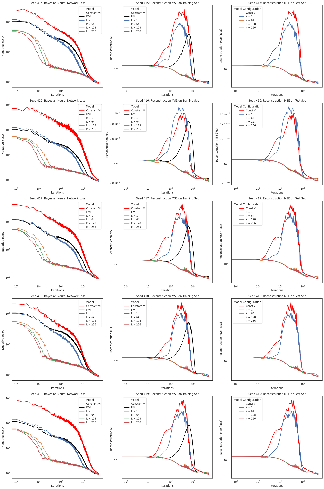

# Closing the Amortization Gap in Bayesian Deep Generative Models

<hr>

## Contents

1. [Background](#Background)
   - [Introduction](#Introduction)
   - [Inference in Variational Autoencoders](#Inference-in-Variational-Autoencoders)
   - [Amortization Gap](#Amortization-Gap)
2. [Model Setup](#Model-Setup)
   - [Encoder](#Encoder)
   - [Decoder](#Decoder) 
   - [Datasets](#Datasets) 
3. [Results](#Results)
4. [References](#References)

<hr>

# Background
## Introduction

In the Bayesian paradigm, statistical inference regarding unknown variables is predicated on computations involving posterior probability densities. Due to the often intractable nature of these densities, which typically lack an analytic form, estimation becomes crucial. Classical methods for estimating the posterior distribution in Bayesian inference such as MCMC are known to be computationally expensive at test time as they rely on repeated evaluations of the likelihood function and, therefore, require a new set of likelihood evaluations for each observation. In contrast, Variational Inference (VI) offers a compelling solution by recasting the difficult task of estimating complex posterior densities into a more manageable optimization problem. The essence of VI lies in selecting a parameterized distribution family, $\mathcal{Q}$, and identifying the member that minimizes the Kullback-Leibler (KL) divergence from the posterior,

```math
q^* = \arg \min _{q \in \mathcal{Q}} \mathrm{KL}(q(\theta, \mathbf{z}) \| p(\theta, \mathbf{z} \mid \mathbf{x})).
```

This process enables the approximation of the posterior with $q^*$, thereby delineating the VI objective to entail the selection of an appropriate variational family $\mathcal{Q}$ for optimization. Common practice in VI applications involves the adoption of the factorized, or mean-field, family. This family is characterized by the independence of the variables

```math
\mathcal{Q}_{\mathrm{F}}=\left\{q: q(\theta, \mathbf{z})=q_0(\theta) \prod_{n=1}^N q_n\left(z_n\right)\right\},
```

wherein each latent variable is represented by a distinct factor $q_n$. 

Contrary to the VI framework, the amortized family leverages a stochastic inference function $f_{\phi}(x_n)$ to dictate the variational distribution of each latent variable $z_n$, typically instantiated through a neural network, facilitating the parameter mapping for each latent variable's approximating factor $q_n(z_n)$:

```math
\mathcal{Q}_{\mathrm{A}}=\left\{q: q(\theta, \mathbf{z})=q_0(\theta) \prod_{n=1}^N q\left(z_n ; f_\phi\left(x_n\right)\right)\right\}.
```

This paradigm, known as *amortized variational inference* (A-VI), optimizes the approximation of the posterior and the inference function simultaneously. Therefore, inference on a single observation can be performed efficiently through a single forward pass through the neural network, framing Bayesian inference as a prediction problem: for *any* observation, the neural network is trained to predict the posterior distribution, or a quantity that allows the network to infer the posterior without any further simulations.

## Inference in Variational Autoencoders

Consider $x$ as the observed variable, $z$ as the hidden variable, and $p(x, z)$ representing their joint distribution. For a dataset $X = \{x_1, x_2, \ldots, x_N\}$, our goal is to maximize the marginal $\log$-likelihood with respect to the model parameters $\theta$, expressed as

```math
\log p_\theta(X) = \sum_{i=1}^N \log p_\theta(x_i) = \sum_{i=1}^N \log \int p_\theta(x_i, z_i) \, dz_i.
```

However, calculating the marginal log-likelihood directly is not feasible due to the integral over the hidden variable $z$. To address this, Variational Autoencoders (VAEs) employ an inference network $q_\phi(z | x)$ as an approximation to the actual posterior $p(z | x)$ and optimize the Evidence Lower Bound (ELBO) relative to both the model parameters $\theta$ and the parameters $\phi$ of the inference network:

```math
\log p(x) = \mathbb{E}_{q(z | x)}\left[\log \left(\frac{p(x, z)}{q(z | x)}\right)\right] + \text{KL}(q(z | x) \| p(z | x)) \geq \mathbb{E}_{q(z | x)}\left[\log \left(\frac{p(x, z)}{q(z | x)}\right)\right] = \mathcal{L}_{\text{VAE}}[q].
```

The ELBO is equivalent to the true log likelihood when $q(z | x) = p(z | x)$. Typically, $q(z | x)$ is chosen to be a factorized Gaussian for its simplicity and computational efficiency. VAEs leverage the inference network (also known as the encoder or recognition network) to generalize inference across the entire dataset efficiently. The model is trained by stochastically optimizing the ELBO through the reparametrization trick, introduced by [Kingma](https://arxiv.org/pdf/1312.6114.pdf).

## Amortization Gap

As illustrated in [Cremer](https://arxiv.org/pdf/1801.03558.pdf), the inference gap, denoted as $\mathcal{G}$, represents the discrepancy between the marginal $\log$-likelihood, $\log p(x)$, and a specific lower bound, $\mathcal{L}[q]$. Identifying the distribution within the set that optimizes this bound, denoted as $q^*(z | x) = \arg \max _{q \in \mathcal{Q}} \mathcal{L}[q]$, allows for the decomposition of $\mathcal{G}$ into two distinct components: the *approximation gap* and the *amortization gap*, expressed as

```math
\mathcal{G} = \log p(x) - \mathcal{L}[q] = \underbrace{\log p(x) - \mathcal{L}\left[q^*\right]}_{\text{Approximation}} + \underbrace{\mathcal{L}\left[q^*\right] - \mathcal{L}[q]}_{\text{Amortization}}.
```

In the context of Variational Autoencoders (VAEs), these gaps can be articulated through KL divergences by reorganizing the equation as follows:

```math
\begin{aligned}
\mathcal{G}_{\mathrm{VAE}} & = \underbrace{\text{KL}\left(q^*(z | x) \| p(z | x)\right)}_{\text{Approximation}} + \underbrace{\text{KL}(q(z | x) \| p(z | x)) - \text{KL}\left(q^*(z | x) \| p(z | x)\right)}_{\text{Amortization}}.
\end{aligned}
```

<hr>

## Model Setup

In all models, we do full Bayesian inference over $\theta$ and $z$. The specifics of our approach include:

- For our variational approximation, we use the family of factorized Gaussians.
- Benchmarks include a constant factor algorithm, which assigns the same factor $q$ to each latent variable $z_n$, and F-VI.
- A-VI is implemented using linear neural networks with 2 hidden layers of varying dimensions.
- To optimize the KL-divergence, we maximize the Evidence Lower Bound (ELBO) $$\mathcal{L} = \mathbb{E}_{q(z,\theta;\nu)}[\log p(\theta, z, x) - \log q(\theta, z)],$$ estimated via Monte Carlo methods.
- Computation of the ELBO incorporates mini-batching techniques.
- The model is trained for 5,000 epochs on 10,000 images. At each iteration, the ELBO is evaluated on a mini-batch of 1,000 images, with each epoch consisting of 10 iterations.

### Encoder

The encoder in a VAE transforms the input data, $x$, into a latent space representation by producing two vectors: the mean $(\mu)$ and the logarithm of the variance $\left(\log \left(\sigma^2\right) \right)$. The encoder architecture comprises sequential linear layers with LeakyReLU activations, followed by separate linear layers for $\mu$ and $\log \left(\sigma^2\right)$.

Given an input $x \in \mathbb{R}^{m}$, the encoder performs the following operations:
1. The input is processed through two sequential linear transformations and LeakyReLU activations: $$h_i=\text{LeakyReLU}\left(W_i h_{i-1}+b_i\right),$$ for $i \in \{1,2\}$, where $h_0=x$, and $W_i$ and $b_i$ represent the weights and biases of the $i^{\text {th }}$ layer, respectively.
2. The final hidden representation, $h$, is used to compute the mean vector, $\mu=W_\mu h+b_\mu$, and the log-variance vector, $\log \left(\sigma^2\right)=W_\sigma h+b_\sigma$, through separate linear layers.

### Decoder

The decoder reconstructs the data from the latent space representation, $z$, by applying a series of linear transformations and LeakyReLU activations. Specifically, the decoder has the following formulation:
1. The latent input $z \in \mathbb{R}^n$ is transformed through a linear layer: $$h_1= \text{LeakyReLU} \left(z W_1^T+b_1\right),$$ where $W_1$ and $b_1$ are the weights and biases of the first transformation layer, respectively.
2. The resulting hidden representation $h_1$ is further processed: $$h_2=\text{LeakyReLU}\left(h_1 W_2^T+b_2\right),$$ utilizing another set of weights and biases $\left(W_2, b_2\right)$ for the second transformation.
3. The final reconstruction is obtained through a linear transformation of $h_2: x_{\text {reconstructed }}=$ $h_2 W_3^T+b_3$, with $W_3$ and $b_3$ denoting the weights and biases for the output layer.

### Datasets

The models are evaluated using a variety of datasets including `CIFAR-10`, `FashionMNIST`, and `MNIST` to ensure a comprehensive assessment across different types of visual data.

<hr>

## Results

The results that follow will be shown for the MNIST dataset. We found similar results for all of the datasets used in this project.

Below is the **negative ELBO** loss for A-VI (with varying hidden dimension widths) vs F-VI and constant-VI. We see that A-VI was able to close the gap to F-VI.

</img>

Below is the **reconstruction MSE on the training set** for all algorithms. We see that A-VI was able to close the gap to F-VI.

</img>

Below is the **reconstruction MSE on the test set** for all algorithms. We see that A-VI was able to close the gap to constant-VI (note that F-VI is not available at test time).

</img>

Since the process of evaluating the amortization gap is inherently random, below are the results over 5 different random seeds. We see that we have similar results across all seeds.

</img>

We can see below that A-VI is considerably faster than F-VI since we only require a single forward pass through the neural network at inference time.

</img>


<hr>

## References
```bibtex
@misc{Ganguly2023,
    title = {Amortized Variational Inference: A Systematic Review},
    author = {Ankush Ganguly and Sanjana Jain and Ukrit Watchareeruetai},
    year = {2023},
    eprint = {2209.10888},
    archivePrefix = {arXiv},
    primaryClass = {cs.AI},
    journal = {Journal of Artificial Intelligence Research},
    volume = {78},
    pages = {167--215},
    url = {https://arxiv.org/abs/2209.10888},
    keywords = {Bayesian}
}
```

```bibtex
@misc{Kingma2022,
    title = {Auto-Encoding Variational Bayes},
    author = {Diederik Kingma and Max Welling},
    year = {2022},
    eprint = {1312.6114},
    archivePrefix = {arXiv},
    primaryClass = {stat.ML},
    url = {https://arxiv.org/abs/1312.6114},
    keywords = {Bayesian}
}
```
```bibtex
@misc{Cremer2018,
    title = {Inference Suboptimality in Variational Autoencoders},
    author = {Chris Cremer and Xuechen Li and David Duvenaud},
    year = {2018},
    eprint = {1801.03558},
    archivePrefix = {arXiv},
    primaryClass = {stat.ML},
    url = {https://arxiv.org/abs/1801.03558},
    keywords = {Bayesian}
}
```
