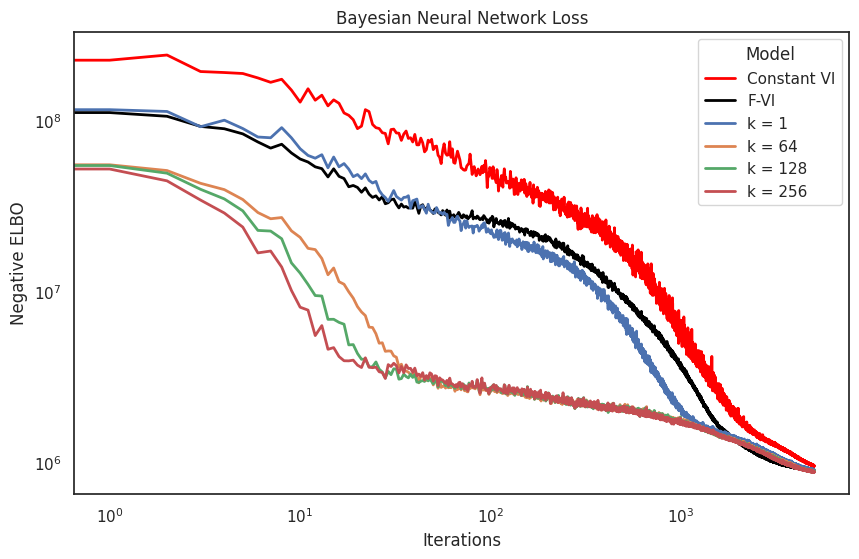
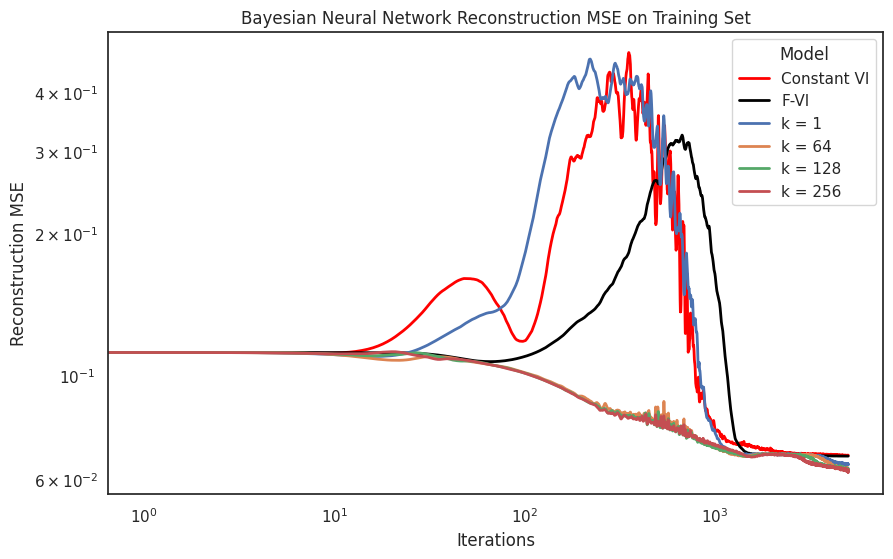
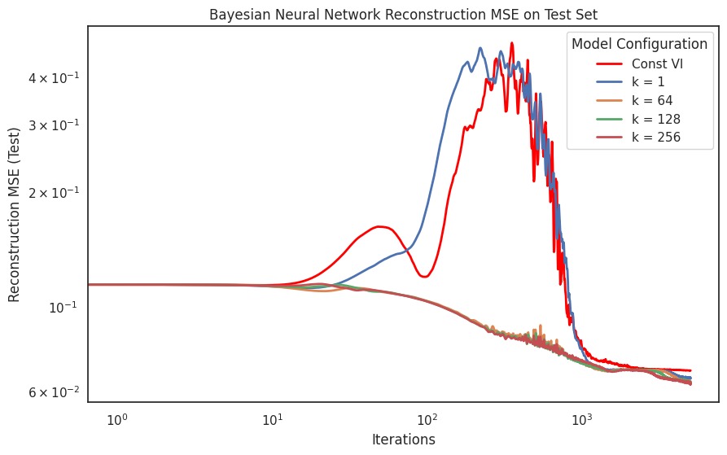
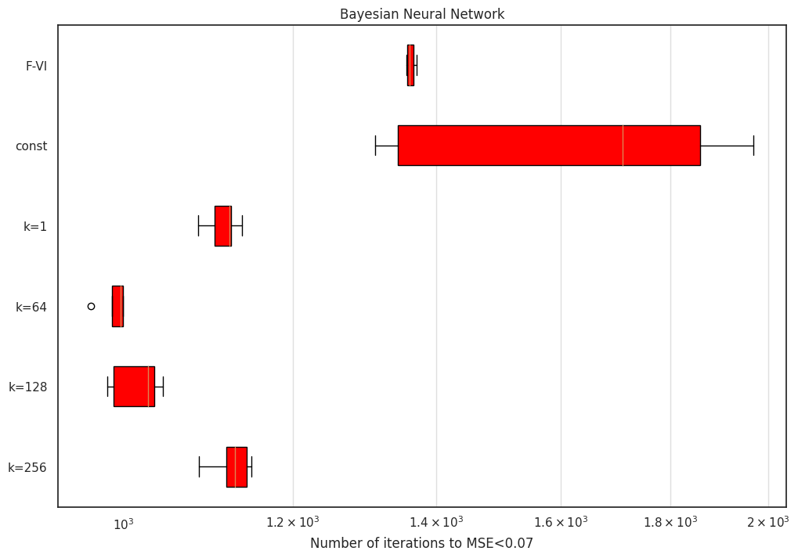
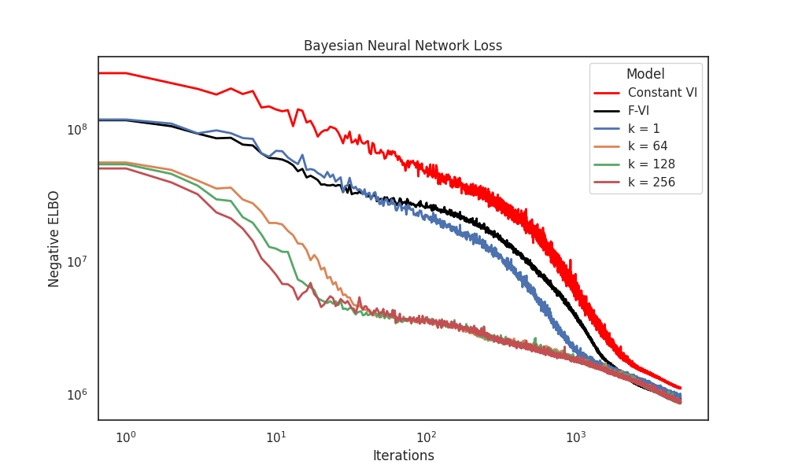
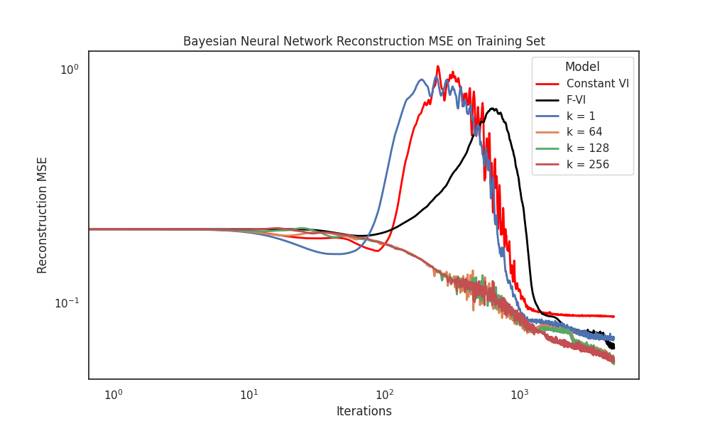
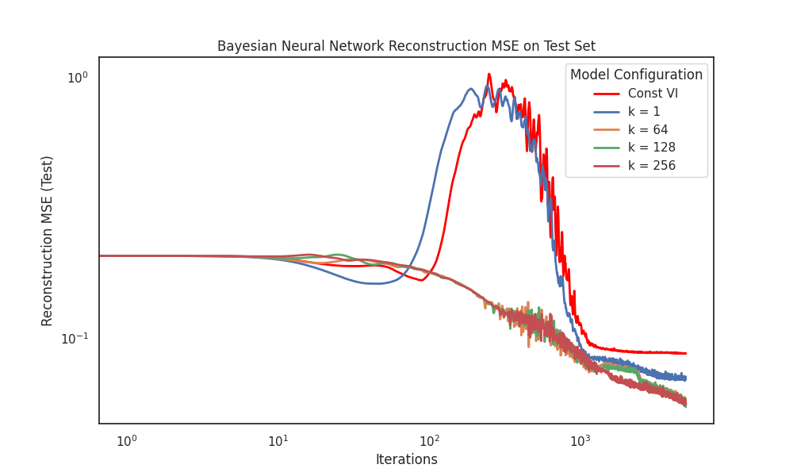
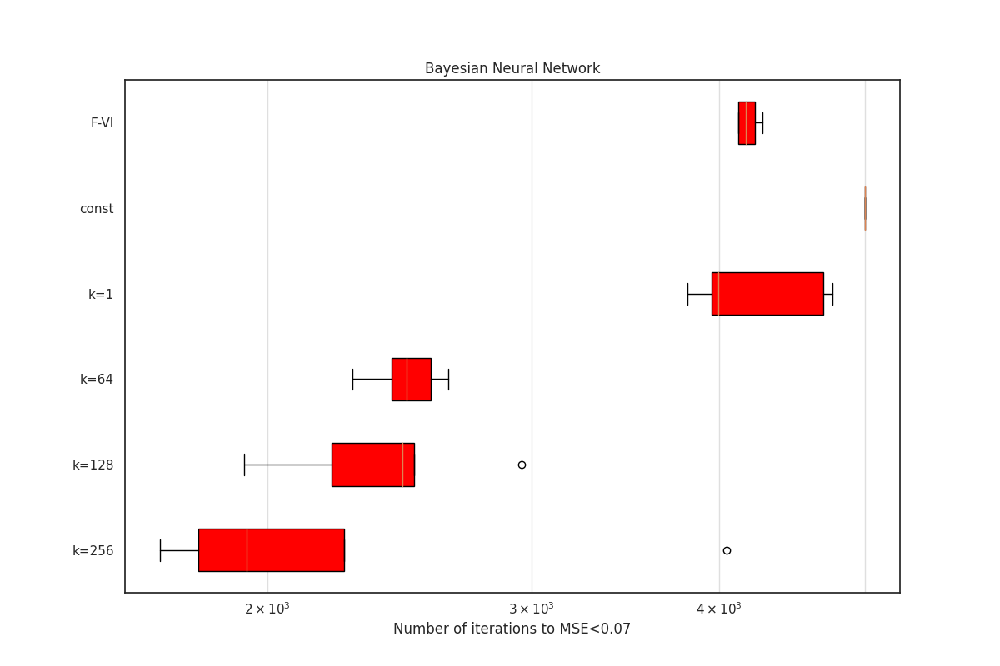
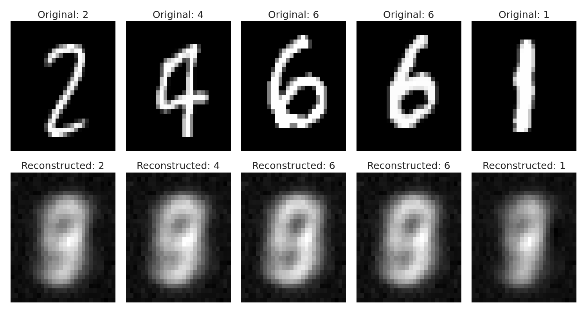
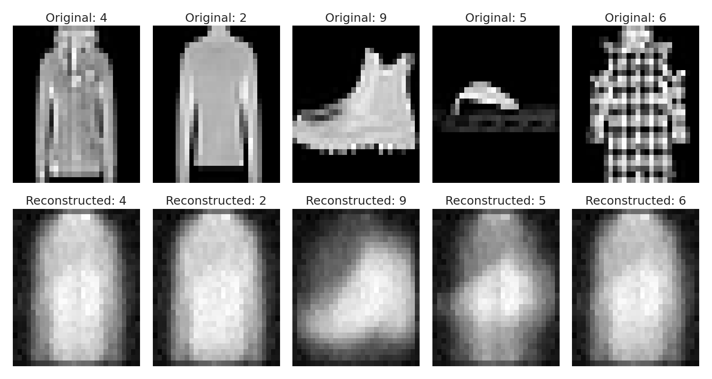

# Closing the Amortization Gap in Bayesian Deep Generative Models

This project explores the integration of amortized variational inference (A-VI) with deep Bayesian Variational Autoencoders (VAEs). We delve into the theoretical foundations and practical applications to close the amortization gap in Bayesian modeling. Through comprehensive numerical experiments, we demonstrate how A-VI enhances computational efficiency and accuracy in modeling on benchmark imaging datasets like MNIST and FashionMNIST.

## Overview

Amortized variational inference (A-VI) has emerged as a promising approach to enhance the efficiency of Bayesian deep generative models. This project investigates the effectiveness of A-VI in closing the amortization gap between A-VI and traditional variational inference methods, such as factorized variational inference (F-VI), or mean-field variational inference. We conduct numerical experiments to compare the performance of A-VI with varying neural network architectures against F-VI and constant-VI.

## Key Findings

- A-VI, when implemented with sufficiently deep neural networks, can achieve the same evidence lower bound (ELBO) and reconstruction mean squared error (MSE) as F-VI while being 2 to 3 times computationally faster.
- These results highlight the potential of A-VI in addressing the amortization interpolation problem and suggest that a deep encoder-decoder linear neural network with full Bayesian inference over the latent variables can effectively approximate an ideal inference function.

## Repository Contents

- **Numerical Experiments**: Scripts and notebooks detailing the experiments conducted, including the comparison of A-VI with F-VI and constant-VI across different datasets.
- **Models**: Implementation of the Bayesian deep generative models using PyTorch.
- **Results**: Detailed results and analysis including comparisons of ELBO and MSE across different models and configurations.
- **Utilities**: Helper functions and utilities for data handling, model training, and evaluation.

## Getting Started

To get started with this project, clone the repository and install the required dependencies:

```bash
git clone https://github.com/your-repository/amortized-bayes.git
cd amortized-bayes
pip install -r requirements.txt
```

```bash
python run_experiments.py
```


## Dependencies

- Python 3.11
- PyTorch 2.1.1
- NumPy
- Matplotlib
- Seaborn

## Main Results

**MNIST**

Our results, presented in Figure 3 for the MNIST dataset, examine the effects of different network widths and configurations. After 5,000 epochs, our amortized variational inference (A-VI) achieved comparable ELBO values to fixed variational inference (F-VI) with sufficiently deep networks (k ≥ 64). We also evaluated the mean squared error (MSE) for image reconstruction on both the training and testing sets and noted that A-VI effectively bridged the performance gap here too.

<table>
  <tr>
    <td></td>
    <td></td>
    <td></td>
  </tr>
</table>
<p align="center">
  Figure 3:<em> Results for the MNIST dataset</em>
</p>

Moreover, A-VI proved to be 2 to 3 times faster computationally than F-VI, as seen in Figure 4, underscoring its efficiency in leveraging shared inference computations across data, thus negating the need to estimate unique latent factors $q_n$ for each $z_n$.

<p align="center">
  
  Figure 4:<em> Computational efficiency of A-VI on MNIST</em>
</p>

**FashionMNIST**

Our results for the `FashionMNIST` experiments are presented in Figure 4 and show the same conclusions as the `MNIST` experiments.

<table>
  <tr>
    <td></td>
    <td></td>
    <td></td>
  </tr>
</table>
<p align="center">
  Figure 4:<em> Results for the FashionMNIST dataset</em>
</p>

We also see a similar increase in computational speed on the `FashionMNIST` dataset as shown in Figure 5.

<p align="center">
  
  Figure 5:<em> Computational efficiency of A-VI on FashionMNIST</em>
</p>

In Figure 6, we present reconstructed images for a sample of five original images from the `MNIST` and `FashionMNIST` datasets. It’s important to note that these reconstructions, produced using a linear neural network, exhibit lower visual quality. This outcome, while noticeable, was not the primary focus of our project. Implementing a convolutional neural network for both the encoder and decoder could significantly enhance the aesthetic quality of these images.

<table>
  <tr>
    <td style="padding-right: 15px;"></td>
    <td style="padding-left: 15px;"></td>
  </tr>
</table>
<p align="center">
  Figure 6:<em> Reconstructed images for MNIST and FashionMNIST</em>
</p>

